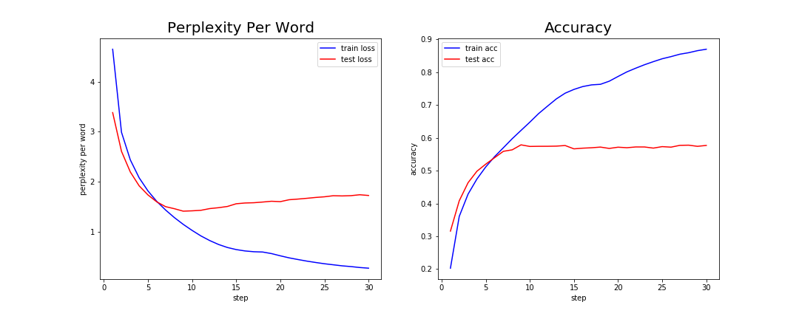
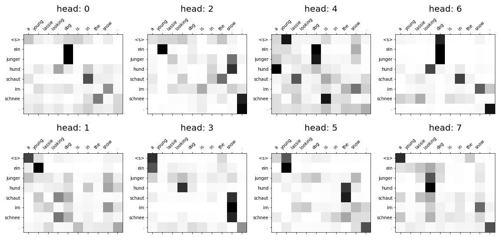

# Annotated-Transformer-KR

The repository that implementated of Transformer with PyTorch. Also some annotation with detail codes.

* Korean Blog: [Annotated Transformer KR](https://www.notion.so/simonjisu/Attention-Is-All-You-Need-5944fbf370ab46b091eeb64453ac3af5)
* Jupyter Notebook: 

## Getting Started

```
$ python main.py --help
```

A quick-start training is also ready for you. You can check basic settings in `run-main.sh`

```
$ sh run-main.sh
```

### Performance: Training Multi30k Result

Trained 35 Steps using NVIDIA GTX 1080 ti, Training excution time with validation: 0 h 43 m 9.6019 s



You can run `python translate.py` to see translate a random sample sentence.

For Example the attention weights(trg-src weight) are something like figure below. You can check all attentions in `figs` folder.

```
Source Sentence:
   a young lassie looking dog is in the snow .
Target Sentence:
   ein junger hund , der aussieht wie lassie , im schnee .
Predicted Sentence:
   ein junger hund schaut im schnee . 
Google Translated Sentence:
   ein junger lassie aussehender hund ist im schnee.
```




### Requirements

```
python >= 3.6
pytorch >= 1.0.0
torchtext
numpy
```

## TODO

1. Train bigger datas and make a demo server
2. Beam Search
3. Calculate BLEU Scores for Translation Task

## references

I checked a lot of references. Please visit them and learn it!

* paper : https://arxiv.org/abs/1706.03762
* reference blog: http://nlp.seas.harvard.edu/2018/04/03/attention.html
* reference code: https://github.com/jadore801120/attention-is-all-you-need-pytorch